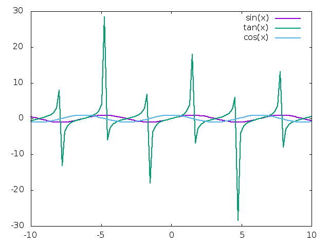
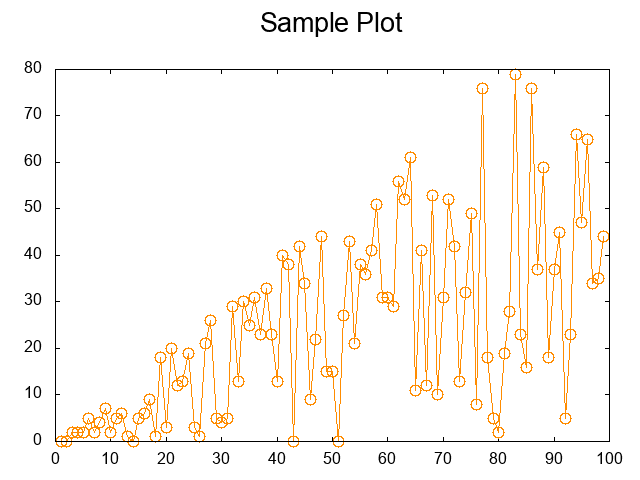

# aquaplot

AquaPlot is a data visualization library for [crystal-lang](https://crystal-lang.org/).  Provides
flexible and powerful charts to bring your data to life.

## Installation

1. Add the dependency to your `shard.yml`:

   ```yaml
   dependencies:
     aquaplot:
       github: crystal-data/aquaplot
   ```

2. Run `shards install`

## Usage

Gnuplot is required.  Please review your operating system's installation
instructions to install the library.

```crystal
require "aquaplot"
```

Right now, creating curves from one or more functions is supported:

```crystal
include AquaPlot

figs = ["sin(x)", "tan(x)", "cos(x)"].map do |fn|
  FunctionLine.new fn, linewidth: 2
end

plt = LinePlot(FunctionLine).new figs
plt.save_fig("static/example_img.png")
```



As is creating graphs from either an Array of `x` coordinates, or Arrays
of `x` and `y` coordinates.

```crystal
x = (1...100).to_a
y = (1...100).map { |index| Random.rand(index) }

fig = ArrayLine.new(
  x, y, with_linespoints: true, pointsize: 2, pointtype: 6, linecolor: "#FF8C00"
)
plt = LinePlot.new fig
plt.set_title("Sample Plot")
plt.show
```




## Development

TODO: Write development instructions here

## Contributing

1. Fork it (<https://github.com/crystal-data/aquaplot/fork>)
2. Create your feature branch (`git checkout -b my-new-feature`)
3. Commit your changes (`git commit -am 'Add some feature'`)
4. Push to the branch (`git push origin my-new-feature`)
5. Create a new Pull Request

## Contributors

- [Chris Zimmerman](https://github.com/christopherzimmerman) - creator and maintainer
