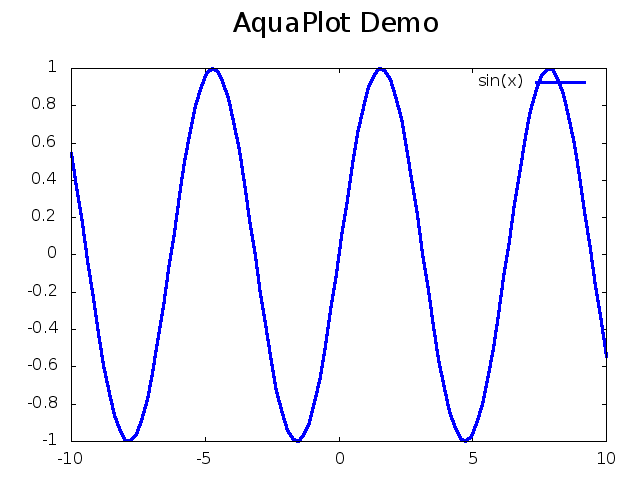

# aquaplot

AquaPlot is a data visualization library for [crystal-lang](https://crystal-lang.org/).  Provides
flexible and powerful charts to bring your data to life.

## Installation

1. Add the dependency to your `shard.yml`:

   ```yaml
   dependencies:
     aquaplot:
       github: crystal-data/aquaplot
   ```

2. Run `shards install`

## Usage

Gnuplot is required.  Please review your operating system's installation
instructions to install the library.

```crystal
require "aquaplot"
```

To create a simple plot from a function:

```crystal
plt = AquaPlot::Plotter.from_function("tan(x)", -10, 10)
plt.set_title("Sample AquaPlot Plot")
plt.show
```




## Development

TODO: Write development instructions here

## Contributing

1. Fork it (<https://github.com/crystal-data/aquaplot/fork>)
2. Create your feature branch (`git checkout -b my-new-feature`)
3. Commit your changes (`git commit -am 'Add some feature'`)
4. Push to the branch (`git push origin my-new-feature`)
5. Create a new Pull Request

## Contributors

- [Chris Zimmerman](https://github.com/christopherzimmerman) - creator and maintainer
