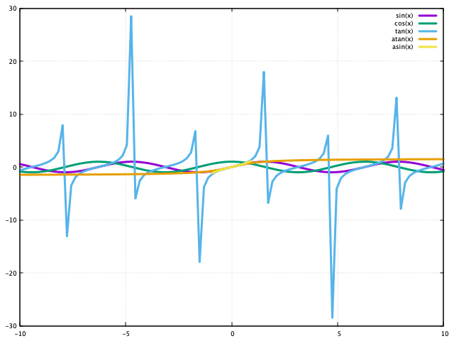

# aquaplot

[](https://gitter.im/crystal-data/aquaplot?utm_source=badge&utm_medium=badge&utm_campaign=pr-badge&utm_content=badge)

AquaPlot is a data visualization library for [crystal-lang](https://crystal-lang.org/).  It provides an easy to user interface to create visually
appealing charts.  This project is currently in extremely unstable and active development.  Contributions are both welcomed and encouraged,
to get this library to a stable and useful state.

## Installation

1. Add the dependency to your `shard.yml`:

   ```yaml
   dependencies:
     aquaplot:
       github: crystal-data/aquaplot
   ```

2. Run `shards install`

## Usage

Gnuplot is required.  Please review your operating system's installation
instructions to install the library.

```crystal
require "aquaplot"
```

### Function Charts

```crystal
fns = ["sin(x)", "cos(x)", "tan(x)", "atan(x)", "asin(x)"].map do |fn|
  AquaPlot::Function.new fn
end

plt = AquaPlot::Plot.new fns
plt.show
plt.close
```



### 3D Function Charts

```crystal
fns = ["x**2 + y**2", "x**2 - y**2", "x**2 * y**2", "x**2 / y**2"].map do |fn|
  AquaPlot::Function.new fn
end

plt = AquaPlot::Plot3D.new fns
plt.set_key("left box")
plt.show
plt.close
```


### 2D Line Charts

```crystal
lines = (1...5).map do |n|
  AquaPlot::Line.new (0...10).map { |el| Random.rand(50) }, title: "Line #{n}"
end

lines[0].show_points
lines[1].set_linewidth 1

plt = AquaPlot::Plot.new lines

plt.set_title("Showing Some Options")

plt.show
plt.close
```


## Development

TODO: Write development instructions here

## Contributing

1. Fork it (<https://github.com/crystal-data/aquaplot/fork>)
2. Create your feature branch (`git checkout -b my-new-feature`)
3. Commit your changes (`git commit -am 'Add some feature'`)
4. Push to the branch (`git push origin my-new-feature`)
5. Create a new Pull Request

## Contributors

- [Chris Zimmerman](https://github.com/christopherzimmerman) - creator and maintainer
