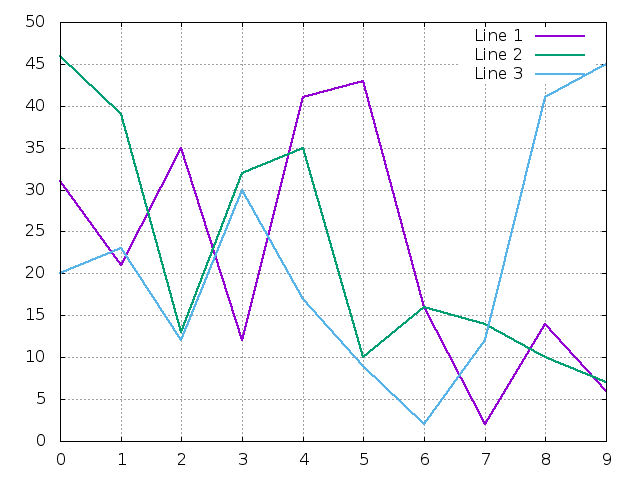
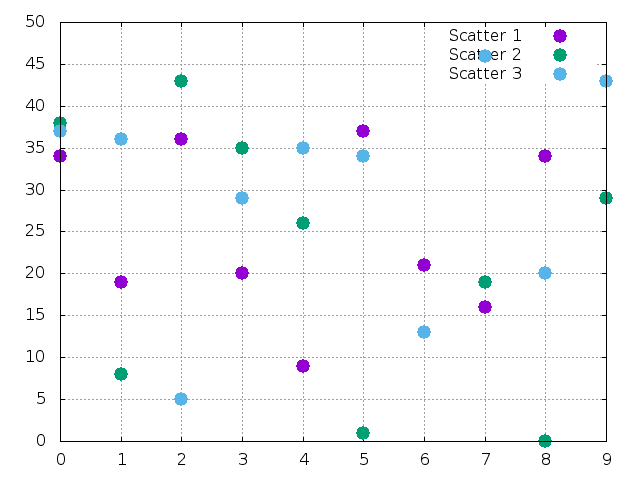
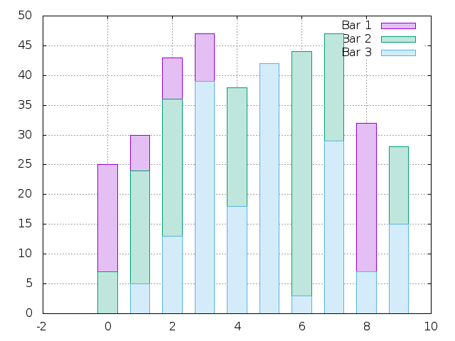
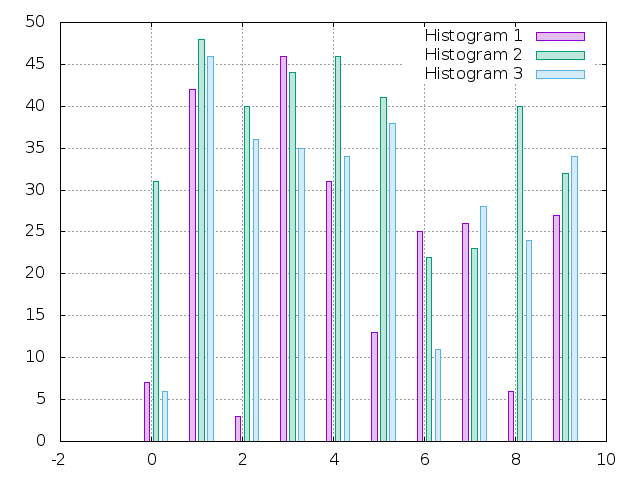

# AquaPlot Examples

## Line Chart

```crystal
lines = (0...3).map do |e|
  Line.new random_data, title: "Line #{e+1}"
end

plt = Plot.new lines
plt.savefig("images/lines.png")
plt.close
```




## Scatter Chart

```crystal
scatters = (0...3).map do |e|
  Scatter.new random_data, title: "Scatter #{e+1}"
end

plt = Plot.new scatters
plt.savefig("images/scatters.png")
plt.close
```




## Bar Chart

```crystal
bars = (0...3).map do |e|
  Bar.new random_data, title: "Bar #{e+1}"
end

plt = Plot.new bars
plt.savefig("images/bars.png")
plt.close
```



## Histogram Chart

```crystal
histograms = (0...3).map do |e|
  Histogram.new random_data, title: "Histogram #{e+1}"
end

plt = Plot.new histograms
plt.savefig("images/histograms.png")
plt.close
```


